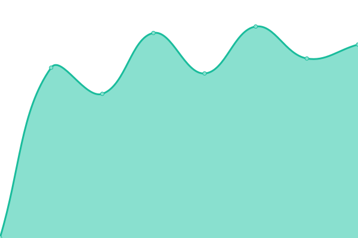
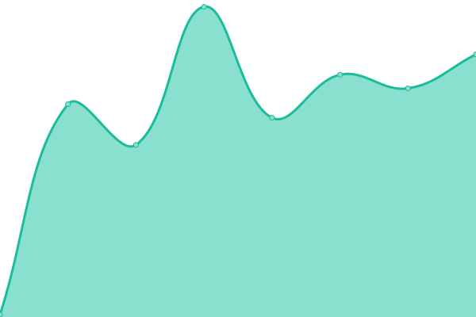
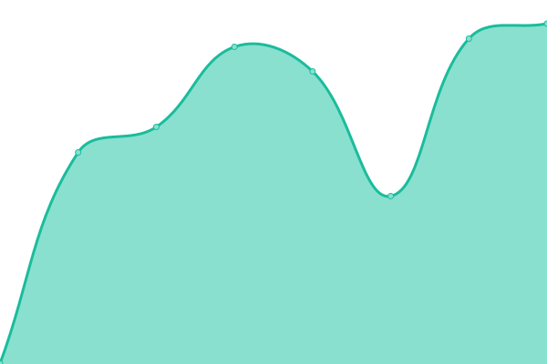
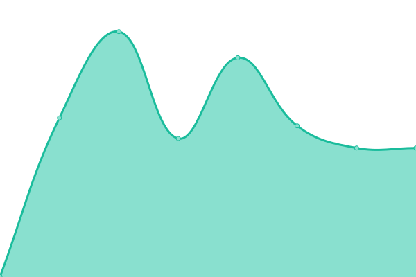

# [📈 Live Status](https://WorklifeTech.github.io/Uptime): <!--live status--> **🟧 Partial outage**

This repository contains the open-source uptime monitor and status page for [WorklifeTech](https://WorklifeTech.github.io/Uptime), powered by [Upptime](https://github.com/upptime/upptime).

With [Upptime](https://upptime.js.org), you can get your own unlimited and free uptime monitor and status page, powered entirely by a GitHub repository. We use [Issues](https://github.com/WorklifeTech/Uptime/issues) as incident reports, [Actions](https://github.com/WorklifeTech/Uptime/actions) as uptime monitors, and [Pages](https://WorklifeTech.github.io/Uptime) for the status page.

<!--start: status pages-->
<!-- This summary is generated by Upptime (https://github.com/upptime/upptime) -->
<!-- Do not edit this manually, your changes will be overwritten -->
<!-- prettier-ignore -->
| URL | Status | History | Response Time | Uptime |
| --- | ------ | ------- | ------------- | ------ |
|  [Cal.com (Howdy)](https://cal.howdy.care) | 🟩 Up | [cal-com-howdy.yml](https://github.com/WorklifeTech/Uptime/commits/HEAD/history/cal-com-howdy.yml) | 

 1046ms
     
 | 

<a href="https://WorklifeTech.github.io/Uptime/history/cal-com-howdy">100.00%</a>
    

|  [Production portal backend](https://api-ne1.worklifebarometer.com/api/ping) | 🟥 Down | [production-portal-backend.yml](https://github.com/WorklifeTech/Uptime/commits/HEAD/history/production-portal-backend.yml) | 

 453ms
     
 | 

<a href="https://WorklifeTech.github.io/Uptime/history/production-portal-backend">0.00%</a>
    

|  [Production portal performance test](https://api-ne1.worklifebarometer.com/api/ping/performance) | 🟥 Down | [production-portal-performance-test.yml](https://github.com/WorklifeTech/Uptime/commits/HEAD/history/production-portal-performance-test.yml) | 

 91ms
     
 | 

<a href="https://WorklifeTech.github.io/Uptime/history/production-portal-performance-test">0.00%</a>
    

|  [Production portal frontend](https://portal.howdy.care) | 🟩 Up | [production-portal-frontend.yml](https://github.com/WorklifeTech/Uptime/commits/HEAD/history/production-portal-frontend.yml) | 

 536ms
     
 | 

<a href="https://WorklifeTech.github.io/Uptime/history/production-portal-frontend">100.00%</a>
    

|  [UAT portal backend](https://wlb-uat-ne1-api.azurewebsites.net/api/ping) | 🟥 Down | [uat-portal-backend.yml](https://github.com/WorklifeTech/Uptime/commits/HEAD/history/uat-portal-backend.yml) | 

 394ms
     
 | 

<a href="https://WorklifeTech.github.io/Uptime/history/uat-portal-backend">0.00%</a>
    

|  [UAT portal performance test](https://wlb-uat-ne1-api.azurewebsites.net/api/ping/performance) | 🟥 Down | [uat-portal-performance-test.yml](https://github.com/WorklifeTech/Uptime/commits/HEAD/history/uat-portal-performance-test.yml) | 

 94ms
     
 | 

<a href="https://WorklifeTech.github.io/Uptime/history/uat-portal-performance-test">0.00%</a>
    

|  [UAT portal frontend](https://wlb-uat-ne1-dashboard.azurewebsites.net/) | 🟩 Up | [uat-portal-frontend.yml](https://github.com/WorklifeTech/Uptime/commits/HEAD/history/uat-portal-frontend.yml) | 

 386ms
     
 | 

<a href="https://WorklifeTech.github.io/Uptime/history/uat-portal-frontend">100.00%</a>
    

|  [App API](https://app.worklifebarometer.com/api/ping) | 🟩 Up | [app-api.yml](https://github.com/WorklifeTech/Uptime/commits/HEAD/history/app-api.yml) | 

 521ms
     
 | 

<a href="https://WorklifeTech.github.io/Uptime/history/app-api">100.00%</a>
    

<!--end: status pages-->

[**Visit our status website →**](https://WorklifeTech.github.io/Uptime)

## 📄 License

- Powered by: [Upptime](https://github.com/upptime/upptime)
- Code: [MIT](./LICENSE) © [Anand Chowdhary](https://anandchowdhary.com), supported by [Pabio](https://pabio.com)
- Data in the `./history` directory: [Open Database License](https://opendatacommons.org/licenses/odbl/1-0/)
